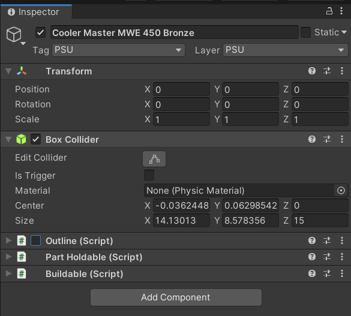
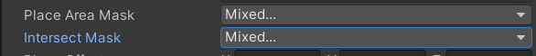
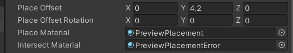
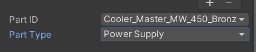
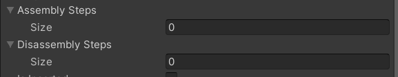
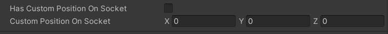

# Adding New parts

---

## GameObject Setup

- In the Hiearchy, create a empty gameObject, Add a collider to it and a buildable component. This will also add other components the buildable script requires.

## Part Holdable Setup

- Go to the `PartHoldable` component and set the `placeAreaMask` to the layer where this part can be placed. A common placeArea is the `holdable Tables` mask. Similarly, set the `IntersectMask` to the layers where this part is not allowed to intersect.

## Place

- Set the place offset and place rotation to the desired values and also the place Material and Intersect Material just like shown below.

## Part ID and Type

- Create a new entry in the `PART_ID` enum in the Buildable script for this new part then set the `partID` value in the inspector as well as it's `partType`

## Steps

- If this part has additional assembly and dissassembly steps than what the buildable socket has, create the steps and assign them to the assembly or disassembly arrays

## Is inserted

- If this part is inserted by default just like a case panel in a socket right away, set the inserted bool to true. You can find more info on how this is setup by looking at the panels in the `ASUS A21 Mesh TG Black` prefab at the `Assets/Core/Scripts/RevisedGameplay/Prefabs/` folder.

## 
- If this part's position is not aligned to the socket when inserted, check the `Custom Position On Socket` boolean and indicate the positions offset below.

After following these steps, you should now have a working computer part.