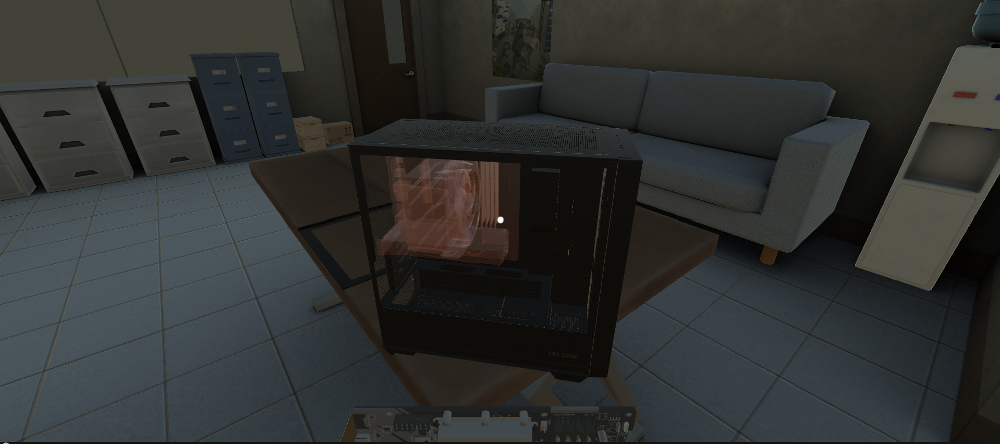

# Introduction

PCBuilding is a game prototype I was tasked to create during my Internship at Far Eastern University Institue of technology (FEU Tech). This documentation serves as a guide for the next developer who will carry on the torch forward.

As of the moment, the project has the following systems:
- Buildable System
- Holdable System
- Paintable System

This system is intended to replace the original drag and drop prototype however with the little time I had, the current features are still missing:
- Shop System integration
- Requirements System
- Challenge Mode
- Tutorial Mode
- Free Build Mode